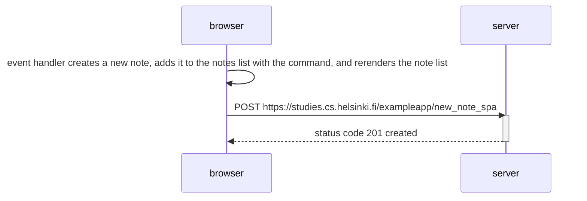

```mermaid
sequenceDiagram
    participant browser
    participant server

    browser->>browser: event handler creates a new note, adds it to the notes list with the command, and rerenders the note list

    browser->>server: POST https://studies.cs.helsinki.fi/exampleapp/new_note_spa 
    activate server
    server-->>browser:  status code 201 created
    deactivate server

```
